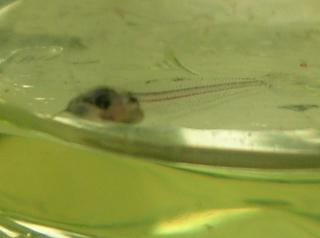
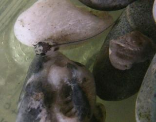
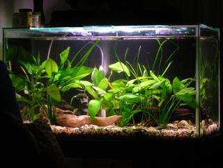
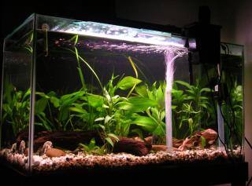

This article is very good:
https://www.planetcatfish.com/shanesworld/shanesworld.php?article_id=474

>All photos by the author
>
>The miracle of life occurred right in my living room, and I didn’t notice for weeks. To be fair, it wasn’t a particularly obvious event - the offspring in question is less than an inch long and pretty much completely transparent.
>
>I was cleaning the under-gravel filter in the aquarium, moving all the logs and plants over to one side and shooing the nervous fish away from the siphon hose, when something darted away over the gravel. It was too small to be any of the intentional inhabitants - even the smallest tetras are pretty obvious. My first thought was that one of the zebra danio fry i’d had in a breeder net a few months back had escaped, survived, and lived undetected in the tank for a while.
>
>But oh no. Closer inspection proved that this little survivor was none other than a glass catfish, Kryptopterus minor, of which we have five adults. These guys are my favorite in the tank, although the loaches (zebras and kuhlis) are pretty cool too. Once I was sure of what I was seeing, I called someone over to confirm I wasn’t hallucinating. I wasn’t.
>
>So I went online to find out about breeding behavior in glass cats. Turns out they pretty much don’t, in captivity anyway, which means that in researching which species we wanted to get, that very important little bit of information slipped through the cracks - we tried not to get fish that were likely to be wild-caught. Although I’m not certain if these are actually wild caught or just commercial farm raised in the far east.
>
>But the fact remains that “baby G” was not a figment of my imagination. Given his size, he had to have been living in the tank unnoticed for weeks. Although Glass cats are egg layers, I didn’t see any eggs developing inside them early on. It may be (a reliable source tells me) that our frequent water changes a few weeks back triggered spawning, although who knows what turns a glass cat on? Seems unlikely that the human race would have been quite as reproductively successful as we have been if our tissues were transparent with our digestive systems on display for all to see. But then, the glass cat’s eye is bigger than its brain.
>
>I haven’t seen baby G since his sudden debut - and not for lack of trying. But if he’s been sneaky enough to live unnoticed for a few weeks, I suppose I shouldn’t worry too much about not being able to find him. Tonight I plan to finish the filter-clean and put the tank back in order, so maybe he’ll turn up again. Fingers crossed - we’re glad you’re here, little guy.
>
>Further to the above, “baby G” turned up again last night! In order to keep him from getting smushed while I moved the gravel around, i caught him and put him in a glass container so i was able to get a few pictures. Not great quality, but you get the idea.
>
>It would be cool to think this brief recording of this event would spur others on to further learn about the captive breeding of this species. Here are some details. The tank is about 270L and had been established for about six months when we found Baby G, in late Feb 2007. It had tetras, cories, loaches and a couple suckers in addition to the glass cats (six), which had been in the tank 3-4 months. There was also driftwood, swords and some twisty valisneria. At the time we were using an under-gravel filter and a small hang-on external filter. I was doing 20-30% water changes every one to two weeks along with vacuuming alternating halves of the tank. Temp has always run 22-24 C although we had a few fluctuations in the months prior (down to 21 and up to 35, especially during an ich treatment and some heater teething troubles about two months leading up to finding Baby G. Water parameters were recorded as pH 6.7-7, NH3 0, NO2 0 and NO3 10-20. We were feeding standard tropical flake food and frozen bloodworms about once a week. Nothing too special or unusual; I really think we just got lucky.

|  |
|:--:|
| *Glass Catfish Spawn* |

*Top View Glass Gatfish Spawn*

*Tank that spawning occured*

*Same tank but different angle*

---

Info from https://www.theaquariumguide.com/articles/glass-catfish   :

* **Family**: *Siluridae*
* **Tank Size**: >100L
* **Size** : 12.5cms
* **Diet** : Omnnivorous
* **Temperature** : Very sensitive to changes in water temperature according to their link to [here](https://iere.org/glass-catfish/)
* **Lifespan** : Up to 8 years

***
Glass Catfish are originally from [Thailand](http://citeseerx.ist.psu.edu/viewdoc/download?doi=10.1.1.204.1904&rep=rep1&type=pdf) where they inhabit moderate moving rivers and streams. They mostly stay in the middle of the water column and rarely stray too far from the safety of the river bed. (Taken from [here](https://www.fishkeepingworld.com/glass-catfish/)) Claims 23-26ºC water temperature. Also:
* Hardness: KH 8-12
* pH: 6.5-7.0
* Water flow: Moderate
Also claims they eat mosquito larvae.

Likes to sit in the middle of the water column in a group. Most pages advise keeping 6 minimum as they are a social, schooling fish.

## Diet

(Reference check this!)

***
How deep is the water they generally live in? What temperature and hardness is the water they breed in? What factors change during monsoon season? Daylight hours? Air pressure? Can air pressure affect fish breeding?

Common elements:
* Breeding after water changes

Parameters that work:
* pH 6.7-7
* NH3 = 0
* NO2 = 0
* NO3 = 10-20
* Fish flakes daily and bloodworms weekly
* 20-30% water changes weekly to fortnightly
* 22-24ºC (lowest 21, highest 35 in months prior)
* 270L Tank

Parameters to vary:
* water temperature

**NB: water temperature may be key to triggering breeding, as this would happen during a water change**
