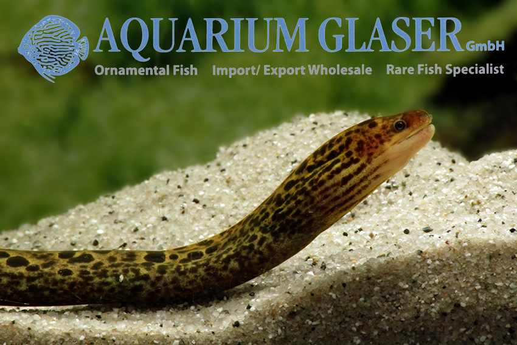
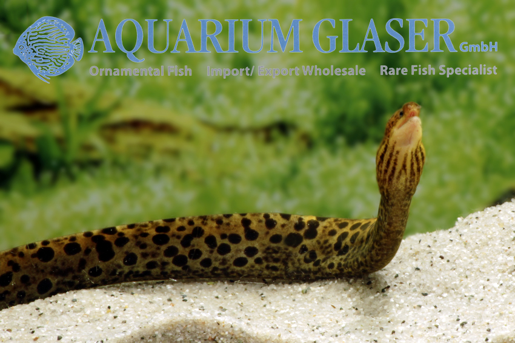
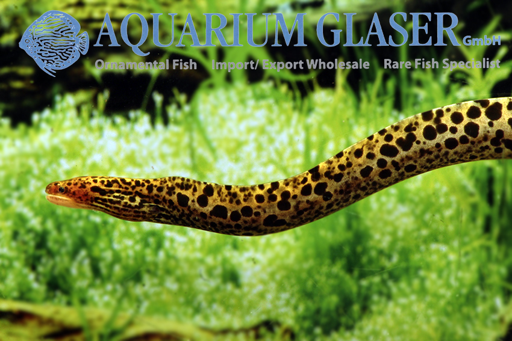
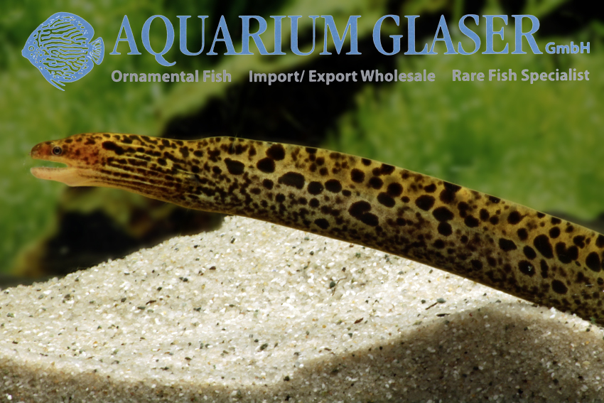
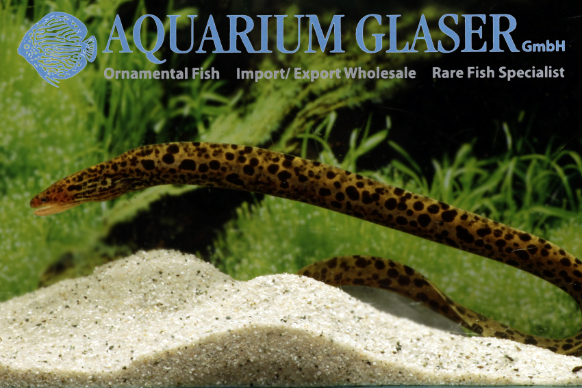

# Gymnothorax polyuranodon
## Freshwater Moray feel

### Introduction
Most pages claim that this eel likes bracksih water. It's not true; *G .polyuranodon* is the **only** species of Family Muraenidae known to reside in freshwater systems.

### Care

Wikipedia page https://en.wikipedia.org/wiki/Gymnothorax_polyuranodon
(Wiki has a large section about aquarium care/trade)

It's a true moray eel.
Native to northern coastline of Australia, PNG, Sri Lanka, Indonesia, and Philippines.

reaches maximum length of 1.5 metres.

---
The following is taken from [here](https://www.aquariumglaser.de/en/fish-archives/gymnothorax-polyuranodon-2/)

| |
|:--:|
| |
| |
| |
| |
| |

We could import this only very rarely available species (despite its wide distribution in the indo-west pacific region) now from Indonesia. Our 10 specimens are juveniles, 20-25 cm long. Maximum length reported for this species is about 150 cm. Each single specimen has an individual pattern of spots.

In the aquarium these morays are very anxious during settlement. So they should be kept along only with absolutely peaceful and calm fish. For feeding one should place some live small feeder fish of about guppy size in the moray tank. When these feeder fish are vanished the morays have started feeding. However, the keeper has to be patient. Often enough this takes several days to weeks. The fasting is usually harmless for the morays.

Breeding appears only in the sea – like in all species of moray. This is the reason why the species is so far spread, as the eggs and the larvae are taken away with the currents. In respect of keeping morays in the aquarium one has to take care that the tanks is absolutely closely covered. Morays will find even the smallest gap and press their body through – often with a fatal consequence. Besides this the pH is important: it should never be on the acidic side, but always over 7.5, better over 8.

Text & photos: Frank Schäfer

---

Following taken from this paper: Distinct habitat selection by freshwater morays in
tropical rainforest streams
