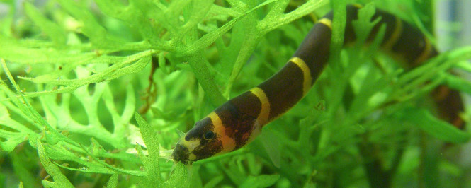

# Kuhli / Coolie loach (*Pangio kuhlii*)

| Parameter | Value |
|---|---|
| Water temperature: 	| 76 to 86 °F (24.5 to 30 °C)|
| pH: |  	5.5 to 6.5 |
| Water Hardness: | 	5 to 10 gH
Recommended tank size: | 	20 gallons for a school of juveniles and 125 gallons for adults.
Grows up to: |	4″ (10.1 cm)
